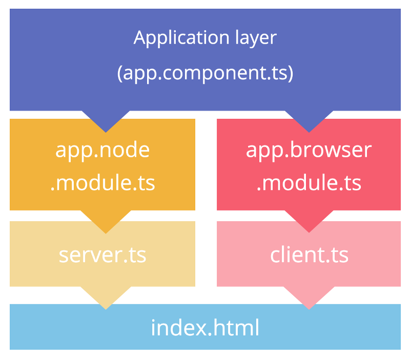

Angular Universal allow to do server side rendering of the angular code.
Waiting front end code generate the page.

It allow that even if a user act on the page (click on items, change page), the changes occurring in the server rendered side is replayed in the client rendered page.

### Concept

* SSR : Server side rendering
* CSR : Client side rendering

### Clone the angular universal starter

* Universal angular starter    
[https://github.com/angular/universal-starter](https://github.com/angular/universal-starter)

### What file do what?

