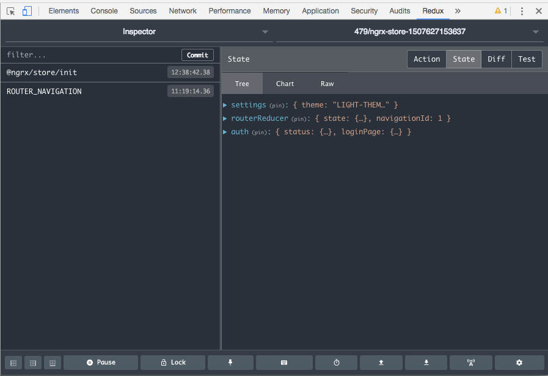

### What it is?
Redux is a way to store in a centralized place data so that all the app  can udpate flowlessly by subscribing to some events. For exemple if a component need to listen udpates of "projects" content, he get informed when this event occur.

### Links to start with

* Angular 2 and Redux simplified 
[https://medium.com/beautiful-angular/angular-2-with-redux-using-ngrx-store-2f93a8ad0dd](https://medium.com/beautiful-angular/angular-2-with-redux-using-ngrx-store-2f93a8ad0dd)

* There is a official [demo / starter app](https://github.com/ngrx/platform/tree/master/example-app) to get a global view on a ngrx based application

* Other [Demo app of angular + redux](https://github.com/ivanderbu2/angular-redux) on how he setup Redux in an angular 2/4 project.

* [In depth tuto about ngrx for angular 2-4 by angular university](https://blog.angular-university.io/angular-ngrx-store-and-effects-crash-course)

* [heavily commented main reducer of ngrx demo app ](https://github.com/ngrx/example-app/blob/master/src/app/reducers/index.ts)

* [UI state managment with Redux in angular 4](https://www.pluralsight.com/guides/front-end-javascript/ui-state-management-with-redux-in-angular-4) in this tuto Hristo Georgiev explain how to use redux in the context of angular 4 to control not only data but also UI like window resizing, hide/display of element.

### Reading blog university tutorial notes

* The tuto start with a description of the facebook counter bug that initiated the switch to a redux like architecture for Facebook homepage. 

* Notion of viewModel which is the derivation of the a model for the diplay purpose of a view. 
* > The transformation from view to view Model is done via a function called a Selector - the input of a Selector is the Model, and the output is the View Model
* the data is stored as a map rather that an array (optimized for by id query (same way firebase used)) 

Example map 

````
{
    1: 
        { 
            id: 1, 
            value: "blue"
        }

}
````

* In the store we store both application model and ui state and user preference...


### What to install 
 
* [store](https://github.com/ngrx/store) The main component (but not obligatory) to install the architecture. For example you can use actions and effects without to the store
* [store dev tools](https://github.com/ngrx/store-devtools) Tools integrated with the chrome extension to debug ngrx powered application
* [router store](https://github.com/ngrx/router-store-builds) integration with the angular router
* [effects](https://github.com/ngrx/effects) Side effects.... (there is a different version for angular 2 and 4)


But since 4 version all those packages are put in [one github repository](https://github.com/ngrx/platform). Installing each libs separetely is though still needed.

````
npm install @ngrx/store @ngrx/store-devtools @ngrx/router-store-builds @ngrx/effects --save
````


Tigger an error is state is not correctly cloned  in the reducer

````
npm install ngrx-store-freeze --save-dev
````

you should then have in your package.json something like 
````
dependencies: {
    "@ngrx/effects": "^4.0.0",
    "@ngrx/router-store": "^4.0.0",
    "@ngrx/store": "^4.0.0",
    "@ngrx/store-devtools": "^4.0.0",
},
"devDependencies": {
    "ngrx-store-freeze": "^0.2.0",
}
````

### NGRX terminology 

* **store**: the shared service managed by the ngrx library that manage state and trigger event when the state is changed (Could be thought as a database front side)
* **state**: Global object that store all global values stored in the store. Each feature module add a property to the store to make available the useful part of the global state
* **reducer**: main function where is defined the logic : (could be thought as the database tables). Pratically the reducer have the role to merge / save the state modification with the state global state. 
* **selector**: function that in charge to retrieved view model structure that are data as need by the UI
* **action**: an action triggered by the user like clicking on a button, changing view that impact the global state. Action can be loading of data, for example The data have just finished loading, we trigger an action.
* **effect**: a change to do when an action is triggered
* **entity**: 

<em>The raw tab or tree tab allow to navigate in the state values</em>



### Reading main reducer of starter app 

This [file](https://github.com/ngrx/example-app/blob/master/src/app/reducers/index.ts) is heavily documented. It is the main reducer of the example app. 
````
/**
 * Every reducer module's default export is the reducer function itself. In
 * addition, each module should export a type or interface that describes
 * the state of the reducer plus any selector functions. The `* as`
 * notation packages up all of the exports into a single object.
 */

import * as fromLayout from '../core/reducers/layout';
````


* Selector could be defined as the query 
* reducer the table 
* the store the database 
from the [comment](https://github.com/ngrx/platform/blob/master/example-app/app/books/reducers/books.ts#L86)
````
/**
 * Because the data structure is defined within the reducer it is optimal to
 * locate our selector functions at this level. If store is to be thought of
 * as a database, and reducers the tables, selectors can be considered the
 * queries into said database. Remember to keep your selectors small and
 * focused so they can be combined and composed to fit each particular
 * use-case.
 */

export const getSelectedId = (state: State) => state.selectedBookId;
```

