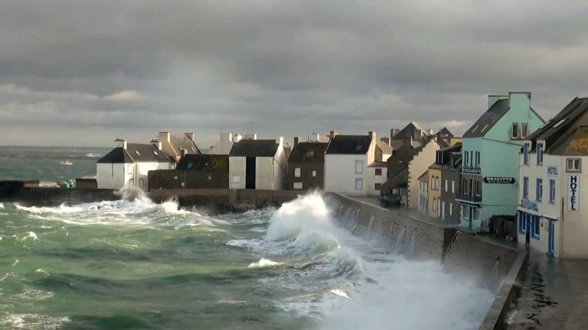

This article is a in progress compilation of events that will probably lead to humanity death due to global warming. 

But do not forget to read the sibling article : (http://www.google.com)[global warming : the humanity will survive]

### Sea rise and land overwhelmed

* [Les eaux montent sur l’île de Sein](https://www.franceculture.fr/emissions/lheure-du-documentaire/lheure-du-documentaire-lundi-24-juillet-2017) A radio documentary in french on the effect of global warming to a small island "sein Island" at the west of britanny peninsula in France.

