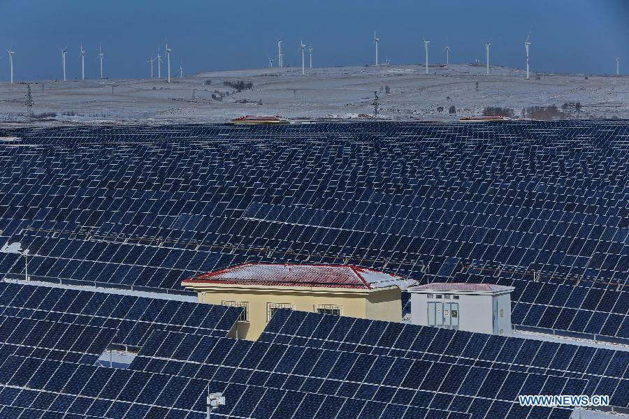

 

This article is a in progress compilation of links to documentate the efforts and solutions to slow down and finally may be stop the global warming and its devasting effects. 

If we fail though, you can read our sibling article : [Global Warning : the humanity will die](http://dev.sebastienlucas.com/global-warming-we-will-die)

<ul>
  <li>
   <a href="#photovoltaic">Photovoltaïc</a>
  </li>
</ul> 

<h3 id="photovoltaic">Photovoltaïc</h3>

* [A giant photovoltaic central in China in the shape of a panda](https://twitter.com/brutofficiel/status/889840668389986305)

<blockquote class="twitter-tweet" data-lang="fr">
La Chine compte sur ce panda géant pour réduire ses émissions de CO2 (oui, vous avez bien lu). <a href="https://t.co/nBd4SO59pB">pic.twitter.com/nBd4SO59pB</a>
&mdash; Brut FR (@brutofficiel) <a href="https://twitter.com/brutofficiel/status/889840668389986305">25 juillet 2017</a></blockquote>
